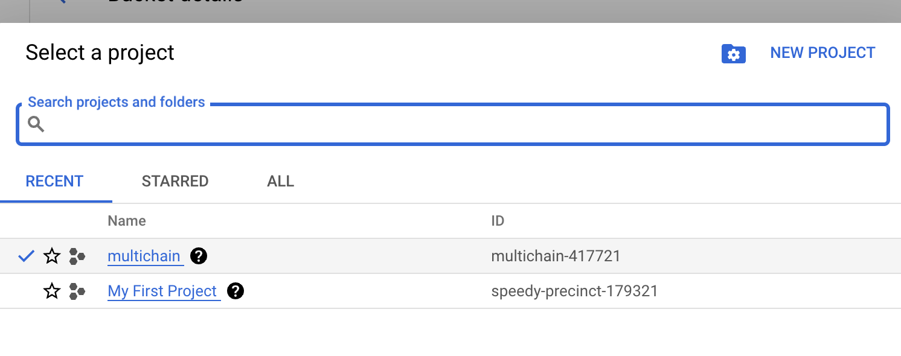
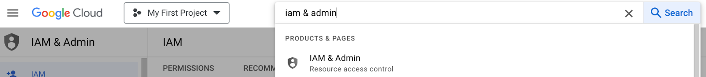
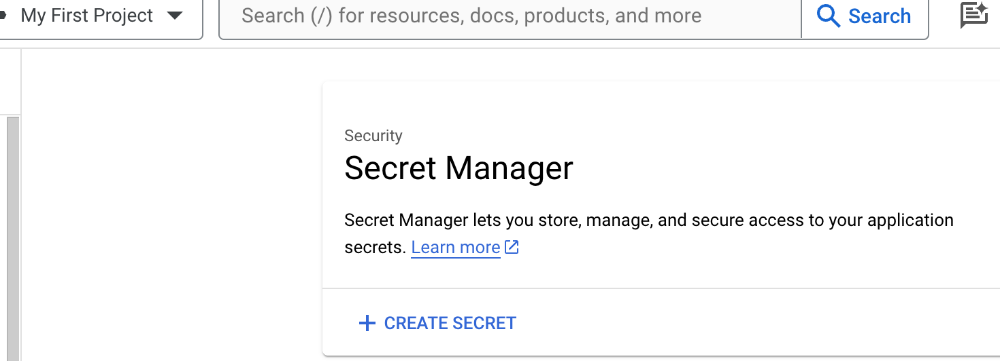
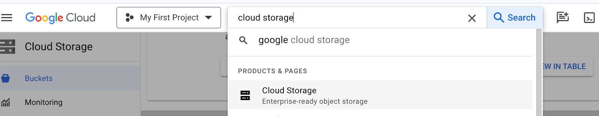
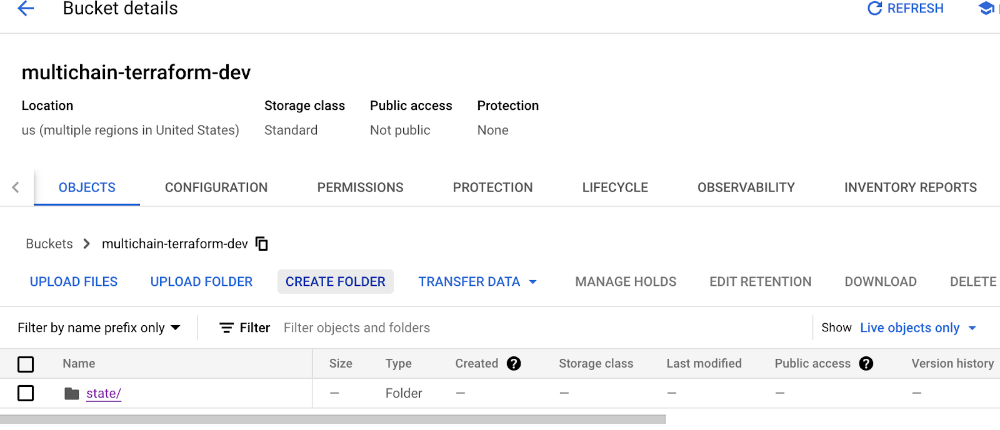
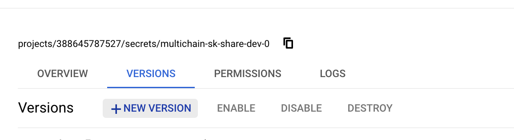
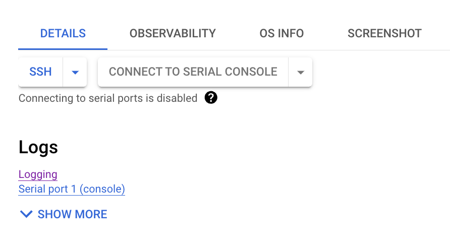
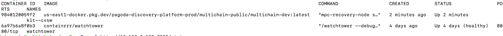

# Multichain Infrastructure Overview

This repository is the source of truth for the infrastructure currently used to deploy partner multichain mainnet nodes.

This README replaces the external Google Doc and is intended to be the tracked, versioned deployment guide for provisioning a brand new partner mainnet node using the Terraform and helper scripts in this repository.

## What this repository covers

This guide walks through:

- GCP project setup
- required APIs and permissions
- Terraform state bucket creation
- key generation
- NEAR account coordination
- GCP Secret Manager population
- Terraform configuration and deployment
- DNS cutover and node verification
- redeploys and debugging

## Prerequisites

Before you begin, make sure you have:

- access to create and administer a GCP project
- permissions equivalent to `Owner` on the project you will deploy into
- a domain or subdomain you can manage in DNS
- a local machine with:
  - `git`
  - `gcloud`
  - `terraform`
  - `rust` / `cargo`
- access to the chain signatures team for:
  - NEAR account creation
  - shared RPC secret values
  - network initialization

## Repository layout used in this guide

Relevant paths in this repository:

```text
scripts/generate_keys/
terraform/partner-mainnet/
terraform/partner-mainnet/scripts/
terraform/partner-mainnet/resources.tf
terraform/partner-mainnet/variables.tf
terraform/partner-mainnet/terraform-mainnet-example.auto.tfvars
```

---

## 1. GCP project setup

### 1.1 Create a new GCP project

Create a new GCP project for the node deployment.

Use a simple project name without spaces or special characters, for example:

```text
partner-multichain
```

You will need the **project ID** later.



You can also use the project search flow in the GCP header if you are switching between multiple projects:


### 1.2 Verify project permissions

Make sure the person performing the deployment is an admin for the org or at least has the `Owner` role on the project.

Search for **IAM & Admin** in the GCP console and confirm your user has the correct role.



### 1.3 Enable Secret Manager

Search for **Secret Manager** in the GCP console.


Enable **Secret Manager API** for the project if it is not already enabled.



### 1.4 Enable Compute Engine / VM Instances

Enable the **Compute Engine API** by opening **VM instances** in the GCP console and clicking **Enable** if required.

### 1.5 Create a Terraform state bucket

Search for **Cloud Storage** in the GCP console.



Create a Cloud Storage bucket for Terraform state.

Recommended bucket naming pattern:

```text
multichain-terraform-<your-entity-name>
```

Recommended settings:

- region: `europe-west1`
- storage class: `Standard`
- public access prevention: enabled
- access control: `Uniform`
- soft delete: `7 days`



### 1.6 Create the `state/mainnet` path

Inside the bucket, create:

```text
state/mainnet
```

This is where Terraform will store the partner mainnet state.

---

## 2. DNS planning

Before deployment, decide what DNS name you want the node to use.

Recommended pattern:

```text
multichain-mainnet-0.<your-domain>
```

You will point an **A record** for this hostname to the load balancer IP after Terraform finishes.

Example:

```text
multichain-mainnet-0.example.com
```

---

## 3. Generate keys

You need to generate:

- cipher keypair
- sign keypair
- NEAR account keypair
- Ethereum account key / address
- Solana account key / address

### 3.1 Install Rust if needed

On macOS or Linux:

```bash
curl --proto '=https' --tlsv1.2 -sSf https://sh.rustup.rs | sh
source "$HOME/.cargo/env"
cargo --version
```

### 3.2 Clone the repository

```bash
git clone https://github.com/sig-net/mpc-infrastructure.git
cd mpc-infrastructure
git checkout main
git pull
```

### 3.3 Run the key generator

```bash
cd scripts/generate_keys
cargo run
```

Save all generated keys securely.

> Do not lose these keys. Treat them as production secrets.

---

## 4. NEAR account setup

### 4.1 Choose a NEAR account name

Choose a new NEAR account name for the node.

Recommended pattern:

```text
<company-name-variation-sig>.near
```

Make sure it does not conflict with an existing account. Check availability on Nearblocks.

### 4.2 Send NEAR account details to the chain signatures team

Send the following to the chain signatures team:

- the NEAR public key generated in the previous step
- the NEAR account name you want created

The team will create the NEAR account for you so you do not need to fund a separate mainnet account just to create it.

After the account is created, verify it on Nearblocks.

---

## 5. Install and authenticate local tooling

### 5.1 Install gcloud

Install the Google Cloud CLI.

For example on macOS:

```bash
brew install --cask google-cloud-sdk
```

### 5.2 Install Terraform

Install Terraform using HashiCorp’s installation method for your platform.

### 5.3 Authenticate with GCP

```bash
gcloud auth login
gcloud auth application-default login
gcloud config set project <your_project_id>
```

If prompted to set the quota project, also run:

```bash
gcloud auth application-default set-quota-project <your_project_id>
```

---

## 6. Upload secrets to Secret Manager

This repository includes a helper script at:

```text
terraform/partner-mainnet/scripts/upload_secrets.sh
```

### 6.1 Move to the scripts directory

```bash
cd terraform/partner-mainnet/scripts
```

### 6.2 Create a local secrets file

Create a file named:

```text
secrets.txt
```

Do **not** commit this file.

The current partner mainnet deployment reads the following secrets from GCP Secret Manager:

```text
multichain-account-sk-mainnet-0
multichain-cipher-sk-mainnet-0
multichain-sign-sk-mainnet-0
multichain-sk-share-mainnet-0
multichain-eth-account-sk-mainnet-0
multichain-eth-consensus-rpc-url-mainnet
multichain-eth-execution-rpc-url-mainnet
multichain-sol-account-sk-mainnet-0
multichain-sol-rpc-ws-url-mainnet
multichain-sol-rpc-http-url-mainnet
```

Use this exact initial format in `secrets.txt`:

```text
multichain-account-sk-mainnet-0=<near account secret key>
multichain-cipher-sk-mainnet-0=<cipher private key>
multichain-sign-sk-mainnet-0=<sign private key>
multichain-sk-share-mainnet-0=1
multichain-eth-account-sk-mainnet-0=<eth account secret key>
multichain-eth-consensus-rpc-url-mainnet=<eth consensus rpc url>
multichain-eth-execution-rpc-url-mainnet=<eth execution rpc url>
multichain-sol-account-sk-mainnet-0=<sol account secret key>
multichain-sol-rpc-ws-url-mainnet=<sol rpc ws url>
multichain-sol-rpc-http-url-mainnet=<sol rpc http url>
```

> `multichain-sk-share-mainnet-0` must initially be set to `1`. You will replace it with a placeholder JSON value in the next step.

### 6.3 Upload the secrets

```bash
./upload_secrets.sh -d <gcp-project-id> -f secrets.txt
```

### 6.4 Replace the key share placeholder

After the secrets are created, open **Secret Manager** in GCP, find:

```text
multichain-sk-share-mainnet-0
```

Upload a new secret version with the placeholder value below.



Add a new version with this exact value:

```json
{"hello":0,"private_share":"1111111111111111111111111111111111111111111111111111111111111111","public_key":"1111111111111111111111111111111111111111111111111111111111111111"}
```

This is a placeholder until the later-generated key share is inserted.

### 6.5 Get shared RPC values if needed

If you do not already have the shared RPC values, request them from the chain signatures team for:

```text
multichain-sol-rpc-ws-url-mainnet
multichain-sol-rpc-http-url-mainnet
multichain-eth-execution-rpc-url-mainnet
multichain-eth-consensus-rpc-url-mainnet
```

### 6.6 Verify all secrets exist

In Secret Manager, confirm that these 10 secrets exist and contain the correct values:

```text
multichain-account-sk-mainnet-0
multichain-cipher-sk-mainnet-0
multichain-sign-sk-mainnet-0
multichain-sk-share-mainnet-0
multichain-eth-account-sk-mainnet-0
multichain-eth-consensus-rpc-url-mainnet
multichain-eth-execution-rpc-url-mainnet
multichain-sol-account-sk-mainnet-0
multichain-sol-rpc-http-url-mainnet
multichain-sol-rpc-ws-url-mainnet
```

### 6.7 Delete the local secrets file

Delete `secrets.txt` and clear it from trash.

---

## 7. Terraform setup

### 7.1 Change into the partner-mainnet Terraform directory

```bash
cd terraform/partner-mainnet
```

### 7.2 Configure the Terraform backend

Edit `resources.tf` and update the backend bucket name:

```hcl
terraform {
  backend "gcs" {
    bucket = "multichain-terraform-<your_entity_name>"
    prefix = "state/mainnet"
  }
}
```

Make sure the bucket name exactly matches the Cloud Storage bucket you created earlier.

### 7.3 Review network behavior

Review `variables.tf` and decide how networking should work for your deployment.

If you **do not** use a shared or custom GCP network:

- delete the default VPC that GCP created automatically for the project
- set `create_network = true`
- let Terraform create the network, router, NAT gateway, and firewall rules

If you **do** use a shared or custom VPC:

- keep `create_network = false`
- make sure your selected network/subnetwork has outbound internet access

> If Terraform hits a `404` while creating router or NAT resources during initial deployment, rerun Terraform. This is still good guidance for first-time bring-up.

### 7.4 Create your tfvars file

Copy the example file:

```bash
cp terraform-mainnet-example.auto.tfvars terraform-mainnet.auto.tfvars
```

Then edit `terraform-mainnet.auto.tfvars`.

### 7.5 Update required tfvars values

At minimum, set:

- `project_id`
- `account`
- `domain`

Example structure:

```hcl
env        = "mainnet"
project_id = "<your_project_id>"

network    = "default"
subnetwork = "default"

image      = "europe-west1-docker.pkg.dev/near-cs-mainnet/multichain-public/multichain-mainnet:latest"
region     = "europe-west1"
zone       = "europe-west1-b"

node_configs = [
  {
    account = "<your-near-account>"
    account_sk_secret_id = "multichain-account-sk-mainnet-0"
    cipher_sk_secret_id  = "multichain-cipher-sk-mainnet-0"
    sign_sk_secret_id    = "multichain-sign-sk-mainnet-0"
    sk_share_secret_id   = "multichain-sk-share-mainnet-0"

    domain = "<your-node-domain>"

    eth_account_sk_secret_id        = "multichain-eth-account-sk-mainnet-0"
    eth_consensus_rpc_url_secret_id = "multichain-eth-consensus-rpc-url-mainnet"
    eth_execution_rpc_url_secret_id = "multichain-eth-execution-rpc-url-mainnet"

    sol_account_sk_secret_id   = "multichain-sol-account-sk-mainnet-0"
    sol_rpc_ws_url_secret_id   = "multichain-sol-rpc-ws-url-mainnet"
    sol_rpc_http_url_secret_id = "multichain-sol-rpc-http-url-mainnet"
  }
]
```

Notes:

- `project_id` should match the GCP project ID you created
- `account` should be the NEAR account ID created for this node
- `domain` should be the final FQDN for the node, not including `https://`
- `region` and `zone` may be changed if desired, but `europe-west1` is the default and preferred region in the current example
- use the current image/tag your team has approved for deployment

---

## 8. Deploy the node

From the repository root:

```bash
git checkout main
git pull
cd terraform/partner-mainnet
terraform init
terraform plan
terraform apply
```

Terraform will create the required resources for the node.

At the end of the apply, note the public IP / load balancer IP that should receive your DNS A record.

After apply finishes, rerun:

```bash
terraform plan
```

You should see no unexpected changes.

---

## 9. Configure DNS and validate the node

Create an **A record** for your node hostname and point it at the IP from the Terraform output.

Example:

```text
multichain-mainnet-0.example.com -> <load-balancer-ip>
```

After DNS propagates, validate the node:

```bash
curl https://<your-node-domain>/state
```

Expected result:

- the endpoint responds successfully
- the node state reports `running`

If the endpoint does not come up immediately, allow time for:

- DNS propagation
- load balancer readiness
- SSL certificate provisioning

---

## 10. Initialize the network

Once the node is up, send the following to the chain signatures team:

- NEAR account ID
- node domain name
- cipher public key
- sign public key
- ETH public key / address
- SOL public key

The chain signatures team uses this information to add your node to the network.

---

## 11. Redeploy the node

Monitor the shared Slack or Discord channels for mainnet release announcements.

For a container image update on the existing COS VM, use:

```bash
gcloud compute instances update-container multichain-mainnet-partner-0 \
  --zone <your-zone> \
  --container-image=europe-west1-docker.pkg.dev/near-cs-mainnet/multichain-public/multichain-mainnet:<current-tag>
```

If your deployment uses a different zone than the example, make sure `--zone` matches your actual instance zone.

---

## 12. Debugging

### 12.1 View logs in GCP

1. Open **VM instances** in the GCP console
2. Click the VM instance for the node
3. Open **Logging**



### 12.2 SSH into the node

SSH to the instance:

```bash
gcloud compute ssh multichain-mainnet-partner-0 --zone <your-zone>
```

List running containers:

```bash
docker ps
```

Use the container ID shown in the output to inspect logs:



Find the container running the multichain image, then inspect logs:

```bash
docker logs <container_id>
```

Search logs for a keyword:

```bash
docker logs <container_id> | grep "<keyword>"
```

View the most recent lines:

```bash
docker logs <container_id> | tail -n 10
```

---

## 13. Common issues

### Secret Manager API not enabled

Symptoms:

- secret creation commands fail
- Terraform cannot read secrets

Fix:

- enable Secret Manager API in the GCP project

### Compute API not enabled

Symptoms:

- Terraform fails when creating instances or related resources

Fix:

- enable Compute Engine / VM Instances API

### Missing outbound internet access

Symptoms:

- instance cannot pull images
- health checks fail
- node cannot reach external RPCs

Fix:

- if using shared/custom VPC, make sure outbound internet exists
- if using Terraform-managed network, rerun apply if router/NAT resources were not ready on the first pass

### DNS not propagated yet

Symptoms:

- `/state` endpoint does not resolve
- HTTPS validation fails

Fix:

- wait for A record propagation
- verify the record points to the expected IP

### Certificate not ready yet

Symptoms:

- HTTPS endpoint not available immediately after apply

Fix:

- allow time for managed certificate and load balancer readiness after DNS points correctly

### Secret values or secret names do not match tfvars

Symptoms:

- container fails to start correctly
- Terraform data lookups fail
- application starts with missing config

Fix:

- verify all secret IDs in `terraform-mainnet.auto.tfvars` exactly match the Secret Manager names

---

## 14. Operational notes

- treat this repository as the source of truth for current deployment behavior
- prefer updating this README in git instead of maintaining an external setup doc
- do not commit plaintext secrets
- do not rely on stale release-specific instructions; always use the current repo state and the current team-approved image/tag
- keep DNS, zone, and secret naming consistent with your actual deployment

---

## 15. Suggested next improvements

Recommended follow-up documentation improvements for this repo:

- split this README into:
  - `README.md` for overview and quickstart
  - `docs/partner-mainnet.md` for the full deployment guide
- add a sample `terraform-mainnet.auto.tfvars.example` with comments trimmed to only user-editable fields
- update `terraform/partner-mainnet/scripts/do-not-commit-example.txt` so it reflects the current 10-secret layout
- add a short architecture diagram for:
  - GCP project
  - VM / COS instance
  - load balancer
  - DNS
  - Secret Manager
  - Terraform state bucket
- add a post-deploy validation checklist
- add a release / upgrade runbook alongside this guide